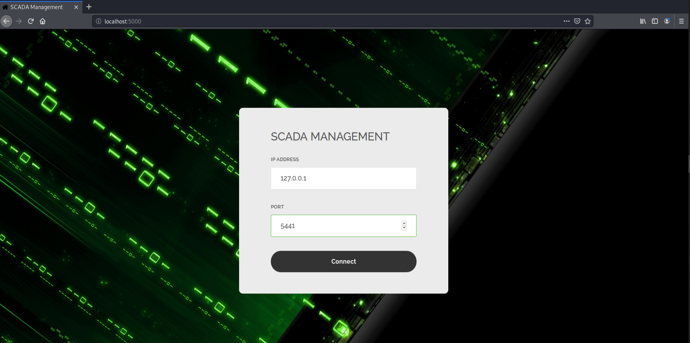
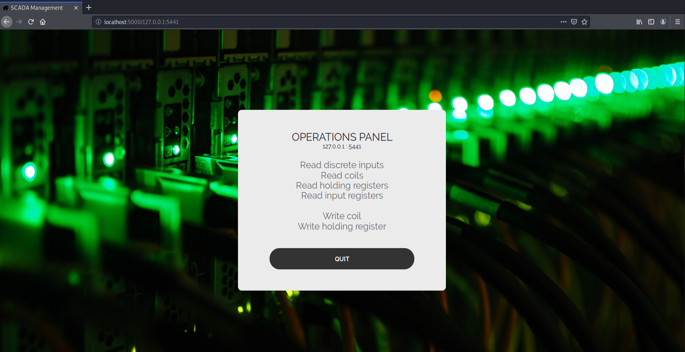
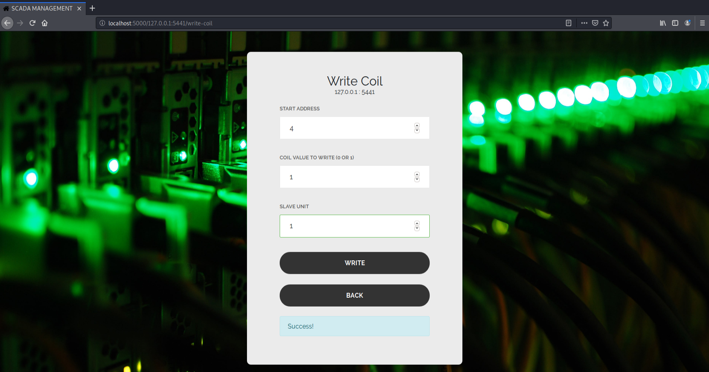
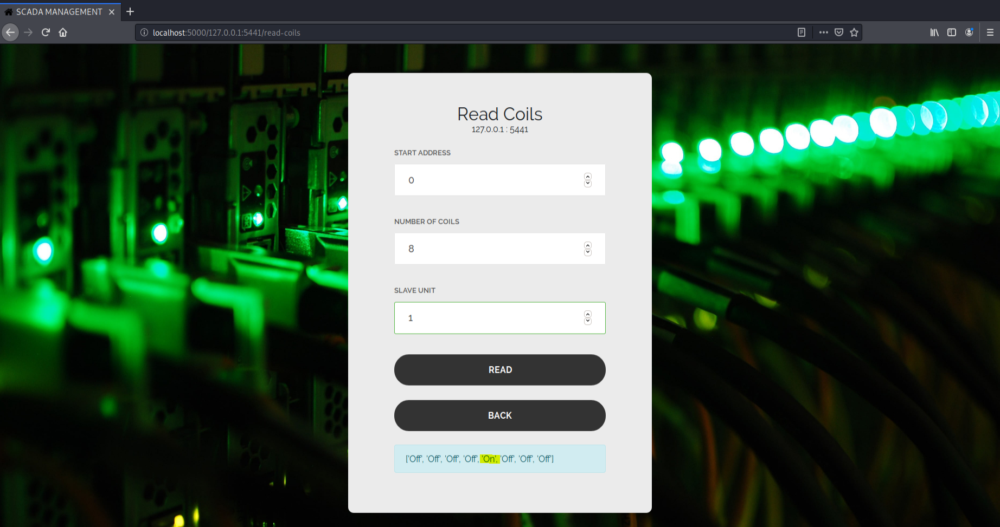

<h3 align="center">BASIC HUMAN-MACHINE INTERFACE FOR MODBUS</h3>
<h5 align="center">Web-based interface for Modbus Master (TCP client) to manage Modbus Slaves (TCP servers)</h3>

## Table of Contents

* [About the Project](#about-the-project)
    * [Prerequisites](#prerequisites)
    * [Installation](#installation)
* [Launch](#launch)

## About the project
Simple web interface based on Python 2.7 and Flask that manages Modbus Slaves through TCP-IP protocol.


### Prerequisites
* Python 2.7
* pip

### Installation
1. Clone the repo
```sh
git clone https://github.com/javier-pg/Basic-Modbus-HMI.git
```
2. Change to Basic-Modbus-HMI directory
3. Install required packages (using a virtual environment such as ```conda``` is highly recommended)
```sh
pip install -r requirements.txt
```

### Launch

1. Run the web server (_by default,  localhost at port 5000_)
```sh
python hmi.py
```

2. Visit _localhost:5000_ on your favourite web browser and introduce the _IP address_ and _port_ of the Slave to be managed.



3. Select the desired operation from the panel. Both read and write operations are available.




4. Fill in the parameters and apply the operation. 

* _For example, write a one in forth coil or read the first eight coils_.






